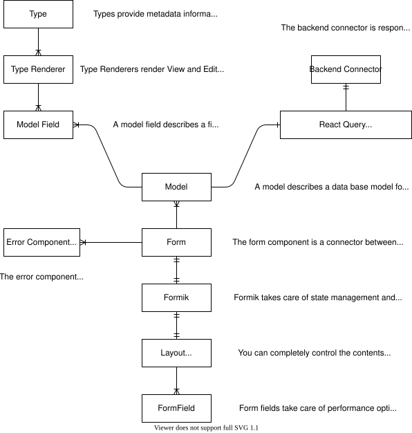

# Form Engine

## Purpose

The form engine enables you to create reusable form components and easily create large, very performant forms with built-in validations.

## Overview

<p align="center">
  
</p>

## Implementing in your application

The following will guide you though the required steps of implementing the form engine.

### Adding a backend connector

First we have to implement our own backend connector, for this we can use the following template code:

<details>
    <summary>TypeScript</summary>
    
```typescript
import {Connector, ModelFieldName, ResponseMeta, ModelGetResponse } from "components-care";

class BackendConnector<
  KeyT extends ModelFieldName,
  VisibilityT extends PageVisibility,
  CustomT
  > extends Connector<KeyT, VisibilityT, CustomT> {
    async index(
		params?: Partial<IDataGridLoadDataParameters>,
        model?: Model<KeyT, VisibilityT, CustomT>    
    ): Promise<[Record<KeyT, unknown>[], ResponseMeta]> {
        throw new Error("Not implemented");
    }

    async create(
        data: Record<string, unknown>,
        model?: Model<KeyT, VisibilityT, CustomT>
    ): Promise<Record<KeyT, unknown>> {
        throw new Error("Not implemented");
    }

    async read(
      id: string,
      model?: Model<KeyT, VisibilityT, CustomT>
    ): Promise<ModelGetResponse<KeyT>> {
        throw new Error("Not implemented");
    }

    async update(
        data: Record<ModelFieldName, unknown>,
        model?: Model<KeyT, VisibilityT, CustomT>
    ): Promise<Record<KeyT, unknown>> {
        throw new Error("Not implemented");
    }

    async delete(
      id: string,
      model?: Model<KeyT, VisibilityT, CustomT>
    ): Promise<void> {
        throw new Error("Not implemented");
    }
/* Only implement if your backend can handle multiple deletes in one request
	async deleteMultiple(
	  ids: string[],
	  model?: Model<KeyT, VisibilityT, CustomT>
    ): Promise<void> {
		return super.deleteMultiple(ids);
	}
*/
/* Only implement if your backend can handle delete all requests
	deleteAdvanced = async (
	  req: AdvancedDeleteRequest,
	  model?: Model<KeyT, VisibilityT, CustomT>
	) => {
        throw new Error("Not implemented");
    };
*/
/* Define if your backend supports data exporters
	dataGridExporters = undefined;
*/
}

export default BackendConnector;

````
</details>

<details>
    <summary>JavaScript</summary>

```javascript
import {Connector, ModelFieldName} from "components-care";

class BackendConnector extends Connector {
    async index(params, model) {
        throw new Error("Not implemented");
    }

    async create(data, model) {
        throw new Error("Not implemented");
    }

    async read(id, model) {
        throw new Error("Not implemented");
    }

    async update(data, model) {
        throw new Error("Not implemented");
    }

    async delete(id, model) {
        throw new Error("Not implemented");
    }
/* Only implement if your backend can handle multiple deletes in one request
	async deleteMultiple(ids, model) {
		return super.deleteMultiple(ids);
	}
*/
/* Only implement if your backend can handle delete all requests
	deleteAdvanced = async (req, model) => {
        throw new Error("Not implemented");
    };
*/
/* Define if your backend supports data exporters
	dataGridExporters = undefined;
*/
}

export default BackendConnector;
````

</details>

The documentation of the methods can be found in the superclass [Connector](../src/backend-integration/Connector/Connector.ts)

### Defining your models

Next up you have to define your data structures in a model. A minimalistic model looks like this:

<details>
	<summary>TypeScript/JavaScript</summary>
    
```typescript
import {Model, ModelDataTypeStringRendererMUI, ModelVisibilityDisabled, ModelVisibilityHidden} from "components-care";
import BackendConnector from "./BackendConnector";

const NameModel = new Model(
    "name-model-id",
    {
        id: {
            type: new ModelDataTypeStringRendererMUI(),
            visibility: {
                overview: ModelVisibilityDisabled,
                edit: ModelVisibilityHidden,
                create: ModelVisibilityDisabled,
            },
            getLabel: () => "ID",
            customData: null,
        },
    },
    new BackendConnector()
);

export default NameModel;

````


</details>

You need to define all additional fields required for your model yourself. A field definition looks like this:

<details>
	<summary>TypeScript diff</summary>

```diff
--- example.ts
+++ example-with-field.ts
@@ -14,6 +14,21 @@
             getLabel: () => "ID",
             customData: null,
         },
+        field_name: {
+            type: new ModelDataTypeStringRendererMUI(), // define your type & renderer here
+            visibility: { // modify to your liking
+                overview: ModelVisibilityDisabled,
+                edit: ModelVisibilityHidden,
+                create: ModelVisibilityDisabled,
+            },
+            getLabel: () => "Field name", // to use i18n: i18n.t.bind(null, "namespace:translation.key")
+            getDefaultValue: () => "Default value, do not define to set no default value", // supports async
+            validate: (value: string, values: Record<string, unknown>): string | null => {
+                if (value !== "valid") return "Value is not 'valid'!";
+                return null; // no validation errors
+            },
+            filterable: true, // optional, used for BackendDataGrid, defualts to false
+            sortable: true, // optional, used for BackendDataGrid, defualts to false
+            onChange: ( // optional on change hook
+                value: string,
+                model: Model<string, PageVisibility, null>,
+                setFieldValue: (field: string, value: unknown, shouldValidate?: boolean) => void
+            ): string => {
+                // you can modify the model itself in here, useful for e.g.: implementing conditional enums
+                return value;
+            },
+            getRelationModel: () => OtherModel, // required for backend connected data types. otherwise undefined
+            customData: null,
+        },
     },
     new BackendConnector()
 );
````

</details>

<details>
	<summary>JavaScript diff</summary>

```diff
--- example.js
+++ example-with-field.js
@@ -14,6 +14,21 @@
             getLabel: () => "ID",
             customData: null,
         },
+        field_name: {
+            type: new ModelDataTypeStringRendererMUI(), // define your type & renderer here
+            visibility: { // modify to your liking
+                overview: ModelVisibilityDisabled,
+                edit: ModelVisibilityHidden,
+                create: ModelVisibilityDisabled,
+            },
+            getLabel: () => "Field name", // to use i18n: i18n.t.bind(null, "namespace:translation.key")
+            getDefaultValue: () => "Default value, do not define to set no default value", // supports async
+            validate: (value, values) => {
+                if (value !== "valid") return "Value is not 'valid'!";
+                return null; // no validation errors
+            },
+            filterable: true, // optional, used for BackendDataGrid, defualts to false
+            sortable: true, // optional, used for BackendDataGrid, defualts to false
+            onChange: (value, model, setFieldValue) => { // optional on change hook
+                // you can modify the model itself in here, useful for e.g.: implementing conditional enums
+                return value;
+            },
+            getRelationModel: () => OtherModel, // required for backend connected data types. otherwise undefined
+            customData: null,
+        },
     },
     new BackendConnector()
 );
```

</details>

#### Defining your own Types and Renderers

Sometimes you need custom controls which aren't included in the default type library. In these cases you need to create your own Renderers or even Types.

Read more about implementing [your own renderers](../src/backend-integration/Model/Types/Renderers/README.md) and [your own types](../src/backend-integration/Model/Types/README.md) by following the respective link.

### Creating an error component

An error component will display the errors occurring in the form and the form components. It has a single property: `error`.
The `error` property is never null. Its `error` property may get updated from time to time.
Your component won't be unmounted until the form gets unmounted.

The error component is the _display_ channel only. Forwarding errors to an error tracker is a separate,
application-wide concern — see [Error reporting](#error-reporting) below.

A basic error component which uses dialogs can be found below:

<details>
	<summary>TypeScript</summary>
	
```tsx
import React, {useEffect} from "react";
import {ErrorDialog, ErrorComponentProps, useDialogContext} from "components-care"

const ErrorComponent = (props: ErrorComponentProps) => {
    const propError = props.error;

    const [pushDialog] = useDialogContext();

    useEffect(() => {
    	pushDialog(
    		<ErrorDialog
    			title={"An error occurred"}
    			message={propError.message}
    			buttons={[
    				{
    					text: "Okay",
    					autoFocus: true,
    				},
    			]}
    		/>
    	);
    	// eslint-disable-next-line react-hooks/exhaustive-deps
    }, [propError]);

    return <></>;

};

export default React.memo(ErrorComponent);

````

</details>


<details>
	<summary>JavaScript</summary>

```jsx
import React, {useEffect} from "react";
import {ErrorDialog, ErrorComponentProps, useDialogContext} from "components-care"

const ErrorComponent = (props) => {
	const propError = props.error;

	const [pushDialog] = useDialogContext();

	useEffect(() => {
		pushDialog(
			<ErrorDialog
				title={"An error occurred"}
				message={propError.message}
				buttons={[
					{
						text: "Okay",
						autoFocus: true,
					},
				]}
			/>
		);
		// eslint-disable-next-line react-hooks/exhaustive-deps
	}, [propError]);

	return <></>;
};

export default React.memo(ErrorComponent);
````

</details>

### Creating the form itself

To create a form you need two things:

- a model
- an error component

A form has two components: `Form` and `FormField`.
The `Form` component stores the form state and provides everything needed for validating and submitting the form.
The `FormField` component renders the field according to the model provided to the `Form` component.

A basic form looks like this:

<details>
	<summary>TypeScript/JavaScript</summary>

```tsx
<Form
	model={NameModel}
	id={null || "id"} // null for create new, "id" for edit existing
	errorComponent={ErrorComponent}
	renderConditionally
>
	{({ isSubmitting, values, submit }) => (
		<>
			<FormField name={"field-name"} />
			<Button
				disabled={isSubmitting}
				onClick={async () => {
					try {
						await submit();
						console.log("Submitted");
					} catch (e) {
						console.log("Validation errors:", e);
					}
				}}
			/>
		</>
	)}
</Form>
```

</details>

`submit` rejects when submitting fails, so that you can react to it. The error is displayed by your
error component either way, which means most call sites end up writing
`try { await submit(); } catch { /* ignore */ }`. Use `safeSubmit` instead of `submit` for those —
it's the same call with the rejection swallowed:

<details>
	<summary>TypeScript/JavaScript</summary>

```tsx
{({ isSubmitting, safeSubmit }) => (
	<>
		<FormField name={"field-name"} />
		<Button disabled={isSubmitting} onClick={() => void safeSubmit()} />
	</>
)}
```

</details>

`safeSubmit` is available on the render props, on `useFormContext()` and on `useFormContextLite()`.
It resolves to `false` if submitting failed and `true` otherwise, so you can still gate follow-up
actions on the outcome:

<details>
	<summary>TypeScript/JavaScript</summary>

```tsx
const onClick = useCallback(async () => {
	if (!(await safeSubmit())) return; // the error is already displayed and reported
	goSomewhereElse();
}, [safeSubmit, goSomewhereElse]);
```

</details>

Note that `true` does not mean the record was saved — `submit` is a no-op when the form isn't dirty
(unless you pass `ignoreDirtyCheck`) and when a `preSubmit` handler cancels submission, and both of
those resolve to `true`. Stick with `submit` when you need the error object itself. Prefer `submit`
in nested forms (`nestedFormName`) too: those don't render an error component of their own, and rely
on the error propagating to the parent form.

### Showing dirty state

A field can be marked as modified with a small blue dot after its label. Nothing is marked
unless you ask for it, and what counts as modified is the application's decision, not the
form engine's.

The form engine's own answer is a diff against the server value, not a "has been edited"
latch: restoring the original value clears the marker, and a value set programmatically is
modified without the user ever having focused the field. It is independent of `touched`.
Switch it on with `showDirtyState`:

```tsx
<Form model={model} id={id} showDirtyState>
	{FormContent}
</Form>
```

The dot is deliberately not an asterisk (that means required) and not a tint of the input
(yellow is a warning, red an error, blue the focus ring) — it sits beside the label so it
stacks with all three.

#### Marking fields yourself

Where the application knows better than the diff does, wrap the fields in a
`DirtyStateProvider`. It takes the marks outright, or a function which is handed the form
engine's own per-field state to build on. A change request workflow is the case this
exists for: the proposed record is saved, so the form is not dirty, and the fields the
proposal touches still have to stand out.

<details>
	<summary>TypeScript</summary>

```tsx
const marks = useCallback(
	(formDirtyFields: DirtyStateMarks) =>
		Object.fromEntries(
			Object.keys(formDirtyFields).map((field) => [
				field,
				formDirtyFields[field] ||
					baselineRecord[field] !== proposedRecord[field],
			]),
		),
	[baselineRecord, proposedRecord],
);

<DirtyStateProvider marks={marks}>{fields}</DirtyStateProvider>;
```

</details>

Memoize `marks`, or declare the function outside the render: a new value re-renders every
field below it.

A provider overrides `showDirtyState` for its subtree, and `Form` always sets the marks —
to its own per-field state with `showDirtyState`, and to none without — so a nested form
never inherits the marks of the form around it.

#### Reading the state

- `RenderParams.dirty` — handed to the type renderer, and forwarded by every renderer in
  the library to its control as a `dirty` prop, the same way `warning` is. This is the
  resolved display state, whatever produced it.
- `useDirtyState(field)` — the same flag, for a custom (non-model) field: reading it makes
  the field follow the same switch as the model fields. `useDirtyState()` returns the whole
  map.
- `useFormContext().dirtyFields` — what the form engine computed, one entry per model
  field, regardless of what is displayed. Custom fields are not in there: a custom field is
  the thing calling `setCustomFieldDirty`, so it already holds its own dirty state; what
  the form does with it is fold it into the form-wide `dirty` flag.
- `showDirtyState` on both the full and the lite form context — was the form asked to mark
  its modified fields? This is the form-wide switch, for a control which holds dirty state
  of its own and wants to display it on the same terms as the model fields. Whether a given
  *field* is marked is `useDirtyState`'s question, and a `DirtyStateProvider` can answer it
  differently.

#### Restyling the marker

Two theme slots, depending on which half you want. `CcFieldState` is shared by every
control wrapped in `withMuiFieldState` — which is where the label pseudo element lives, the
selectors' own label included — and `CcDirtyMarker` styles the element version, rendered by
the three controls whose label the pseudo element can't reach: `FileUploadGeneric` and
`ImageSelector` (fieldset legend) and `MultiSelectWithTags` (a `Typography` title):

<details>
	<summary>TypeScript</summary>

```ts
createTheme({
	components: {
		// recolour the element version
		CcDirtyMarker: { styleOverrides: { root: { backgroundColor: "#7b1fa2" } } },
		// italic label instead of a dot, everywhere else
		CcFieldState: {
			styleOverrides: {
				root: {
					"& > .MuiFormLabel-root::after": { display: "none" },
					"& > .MuiFormLabel-root": { fontStyle: "italic" },
				},
			},
		},
	},
});
```

</details>

One thing to know if you replace the dot with something wider: an outlined input sizes the
gap in its border from a second copy of the label that a pseudo element cannot reach, so
the stock styles widen that gap by the width of the dot. A wider marker has to widen it
further, through `& > .MuiOutlinedInput-root .MuiOutlinedInput-notchedOutline legend`.

For a custom renderer, `DirtyMarker` (an element) and `dirtyMarkerStyles` (for a pseudo
element) are both exported, so a control can draw the same marker wherever its label is.

The `Backend-Components/Form` stories show all three modes: `DirtyState` marks the form's
own diff across a text field, an outlined multiline one, a searchable select, a date, an
image selector, a radio group, a checkbox and a switch; `DirtyStateHidden` is the default;
`DirtyStateProvided` supplies its own marks.

### Error reporting

Independently of what your error component displays, Components-Care forwards unexpected errors to an
error tracker. If `@sentry/react` is installed it is used automatically, otherwise nothing happens.
By default a `ValidationError` and a `NetworkError` are **not** reported (neither is actionable —
one is a normal part of the form flow, the other is usually the user's connection), while a
`BackendError` and code errors (`Error`, `TypeError`, ...) are.

Both the policy and the destination are configurable from your application's startup code:

<details>
	<summary>TypeScript/JavaScript</summary>

```ts
import { configureErrorReporting, CcErrorNames } from "components-care";

configureErrorReporting({
	// where reported errors go (default: Sentry's captureException, if available)
	report: (error, context) => myTracker.capture(error, context.source),
	// which errors get reported
	shouldReport: (error) => error.name !== CcErrorNames.NetworkError,
	// additionally console.error everything, regardless of shouldReport (default: false)
	logToConsole: import.meta.env.DEV,
});
```

</details>

Errors are matched by `Error.name`, not by `instanceof`, because the error classes may cross bundle
boundaries. `CcErrorNames` holds the names of every error class the library raises:

| Constant                            | `Error.name`         | Reported by default |
| ----------------------------------- | -------------------- | ------------------- |
| `CcErrorNames.ValidationError`      | `CcValidationError`  | no                  |
| `CcErrorNames.NetworkError`         | `NetworkError`       | no                  |
| `CcErrorNames.BackendError`         | `BackendError`       | yes                 |
| `CcErrorNames.RequestBatchingError` | `RequestBatchingError` | yes               |
| `CcErrorNames.ImageLoadError`       | `CcImageLoadError`   | yes                 |

An `ImageLoadError` is raised when the browser can't decode an image the user selected — an
unsupported format (HEIC, TIFF) or a corrupt file. The user is always shown a message for it, so if
you don't want these in your error tracker, filter the name out via `shouldReport`.
